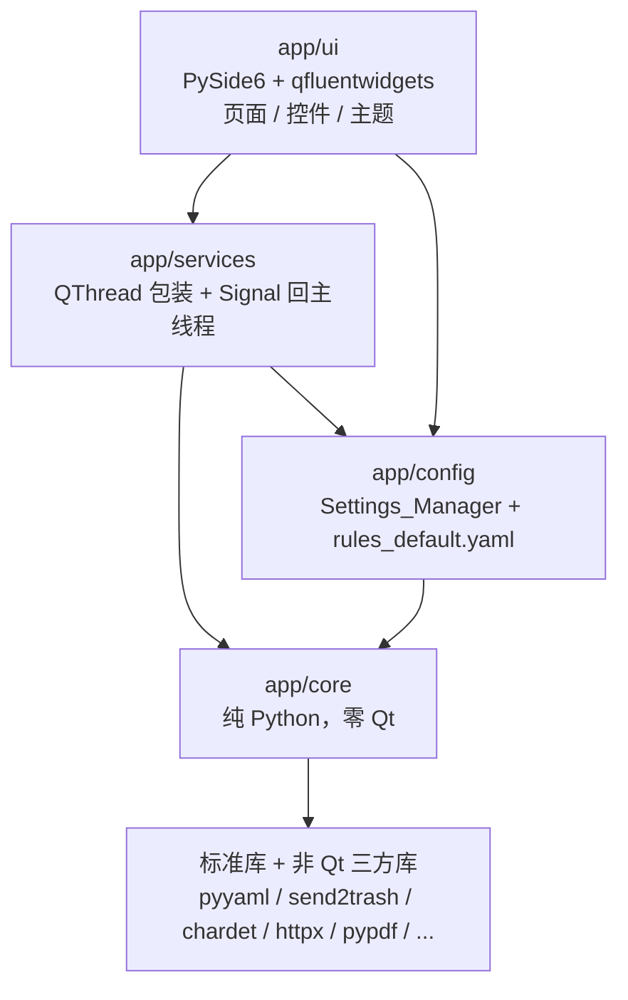
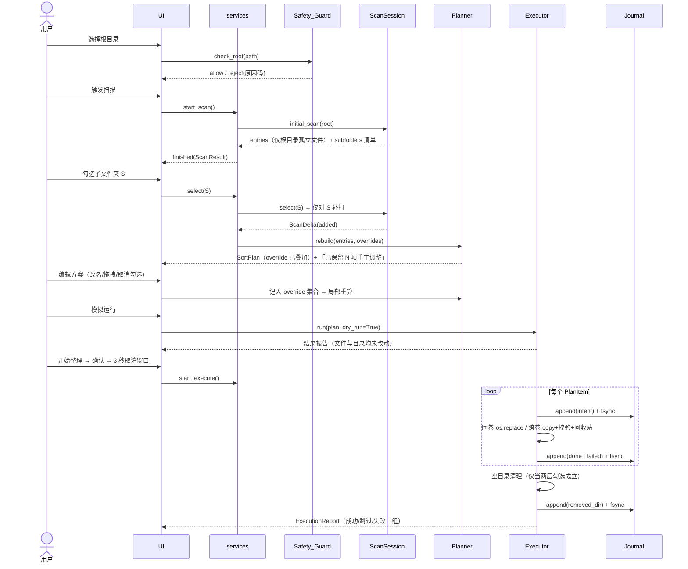
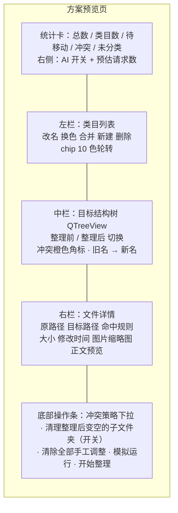

# 设计文档：DocSorter 文档分类工具

## 概览

DocSorter 是一个单进程 Windows 桌面应用：界面用 PySide6 + PySide6-Fluent-Widgets 构建，全部业务逻辑收在一个零 Qt 依赖的 `app/core` 层里。这个切分是整份设计的地基——因为需求里几乎所有可验证条目（分类确定性、序列化往返、撤销往返、幂等、范围外不变性）都落在 core 层，而 core 层没有 Qt 就意味着这些条目能用 pytest + Hypothesis 在临时目录里直接跑，不需要拉起窗口。

设计围绕四个主循环组织：

1. **扫描循环**：根目录准入 → 收集孤立文件 → 产出子文件夹清单 → 用户逐个勾选触发增量补扫。范围状态由一个长期存活的 `ScanSession` 持有，勾选/取消勾选只做增量。
2. **规划循环**：`ClassifierPipeline` 产出基础方案 → `OverrideLayer` 把用户手工调整叠加上去 → `TargetAllocator` 构造目标路径并做五态冲突预检。任何触发重算的操作都重跑这条链，override 集合是链上的独立输入，因此不会被冲掉。
3. **执行循环**：`intent` 落盘 → 单文件操作（同卷原子重命名 / 跨卷复制校验后源进回收站）→ `done`/`failed` 落盘。日志写主副本与根目录镜像两份，每条 fsync。空目录清理是执行的收尾阶段，只在两层勾选都成立时才会动目录。
4. **撤销循环**：读 journal → 重建 `removed_dir` → 逆序还原文件 → 清掉自己创建的空目录。撤销自身也写日志，因此重做只是「撤销的撤销」，走同一套代码。

三条产品红线在设计上的落点：可复原性靠 journal 双写 + fsync + 撤销前 size/mtime 校验；AI 可选性靠 `Provider` 抽象 + 统一的五类失败回落到规则引擎；目录结构默认不变靠「扫描范围默认只含根目录孤立文件」+「空目录清理的候选集合被限制为用户已勾选且本次确有文件移出的目录」。

### 技术栈与运行环境

| 项 | 选择 | 理由 |
| --- | --- | --- |
| 语言 | Python 3.13（备选 3.12） | conda base 为 3.13.x；若目标环境中任一依赖无 3.13 wheel 则整体退回 3.12 |
| Qt 绑定 | PySide6（LGPL） | 需求 18.4 明确要求 LGPL 绑定，不使用 PyQt6 |
| 组件库 | PySide6-Fluent-Widgets（import 名 `qfluentwidgets`） | 提供 Fluent 观感、`FluentWindow` 侧边导航、主题跟随系统 |
| 环境 | conda env `SortingTool`（`C:\Users\111\miniconda3\envs\SortingTool`） | 与 base 隔离，避免 base 的包污染打包结果 |
| 运行期依赖 | pyyaml、send2trash、chardet、keyring、httpx、pypdf、python-docx、openpyxl、python-pptx | 分别对应规则/配置序列化、回收站、编码探测、凭据、LLM HTTP、四种文档正文提取 |
| 开发期依赖 | pytest、pytest-qt、hypothesis、pyinstaller | 单测 / 少量 UI 测 / 属性测试 / 打包 |

研究结论中影响设计的两点：

- **PySide6 与 Python 3.13**：PySide6 6.6 系列的 wheel 元数据把 Python 上限写在 3.13 以下，Python 3.13 需要 6.8 及以上版本；当前 PySide6-Essentials 的 wheel 声明的 Python 区间上限已放宽到 3.15 以下（参考 [PySide6-Essentials on PyPI](https://pypi.org/project/PySide6-Essentials/) 与 [Qt for Python wiki 的 Python 兼容矩阵](https://wiki.qt.io/Qt_for_Python)）。因此 3.13 环境下必须约束 `PySide6>=6.8`，这是 3.13/3.12 二选一的判定依据。内容已改写以符合来源的许可要求。
- **组件库授权**：PyQt/PySide-Fluent-Widgets 系列在 PyPI 上标注的授权是 GPLv3（参考 [PyQt-Fluent-Widgets on PyPI](https://www.pypi.org/project/PyQt-Fluent-Widgets/1.10.1/)），作者另提供商业授权。这与「选 PySide6 以取得 LGPL」的初衷存在张力：一旦分发包含该库的 exe，整体分发就要满足 GPLv3 的义务（开放对应源码）或改用商业授权。本设计不改变技术选型，但把这一点记为需要用户决策的许可事项：若本工具仅自用或愿意以 GPLv3 开源则无影响；若要闭源分发，需替换组件库或购买商业授权。内容已改写以符合来源的许可要求。

### 依赖版本锁定策略

本会话无法执行命令，因此 `requirements.txt` 的具体版本号在设计阶段留空，采用如下策略而非编造版本：

1. 先在 Anaconda Prompt 中创建环境并安装（安装源建议显式指定 `https://pypi.org/simple`，因为镜像源上的 `*-Fluent-Widgets` 常年落后，容易出现 `ImportError: cannot import name 'XXX' from 'qfluentwidgets'`）。
2. 安装完成后以 `pip list --format=freeze` 的实际结果回填 `requirements.txt`，全部依赖使用 `==` 精确锁定。
3. 唯一在设计阶段就写死的约束是 `PySide6>=6.8`（Python 3.13 前提），以及**不得同时安装** `PyQt-Fluent-Widgets`、`PyQt6-Fluent-Widgets`、`PySide2-Fluent-Widgets`、`PySide6-Fluent-Widgets` 中的多个——它们的顶层包名同为 `qfluentwidgets`，会互相覆盖。
4. `pyproject.toml` 只声明依赖名与下界，`requirements.txt` 承担精确锁定职责，两者分工不重叠。

## 架构

### 分层与依赖方向



依赖规则（对应需求 18.7）：

- `core` 不 import `PySide6`、不 import `app.services`、不 import `app.ui`、**也不 import `app.config`**。core 需要的配置以「窄选项对象」的形式注入（`ScanOptions`、`ClassifyOptions`、`ExecOptions`、`AIOptions`），这些选项 dataclass 定义在 core，由 config 层从 `Settings` 构造。这样 config → core 是单向依赖，不会成环。
- `core` 与外界的交互只通过三种形式：入参、返回值、普通 callable 回调（`on_progress`、`CancelToken`）。core 里没有任何 `Signal`。
- `services` 是唯一允许同时看见 Qt 与 core 的层：它把 core 的 callable 回调翻译成 Qt 信号，把 core 的阻塞调用放进 `QThread`。
- `ui` 只与 `services` 和 `config` 对话，不直接 import `core` 的执行类；但**允许 import `core.models`** 中的纯数据类与枚举用于展示，避免为展示再造一套 DTO。

这套边界的直接收益：`python -m app.core.cli --root D:\Downloads --strategy by_type --dry-run` 可以在没有 Qt 的环境里跑通整条规划链，属性测试也因此不需要 `QApplication`。

### 目录结构

```
app/
  main.py                     # QApplication 装配、异常钩子、首次运行释放资源
  core/                       # 零 Qt
    models.py                 # 全部领域模型与枚举（含 ScanScope / OverrideSet）
    safety.py                 # Safety_Guard：根目录准入、路径越界、符号链接策略
    scanner.py                # Scanner + ScanSession（扫描范围状态与增量补扫）
    inspector.py              # Content_Extractor：正文前 4KB 提取
    rules.py                  # Rule_Engine + Rule_Serializer
    classifiers/
      base.py                 # Classifier 协议、Suggestion、ClassifierPipeline、策略装配表
      by_extension.py
      by_date.py
      by_filename.py
      by_content.py
      by_llm.py
    llm/
      provider.py             # Provider 协议 + 统一失败分类
      openai_compat.py        # OpenAICompatProvider
      ollama.py               # OllamaProvider
      taxonomy.py             # 两阶段调用、类目归并、≤12 类 ≤2 级收敛
      cache.py                # SQLite 批级缓存
    overrides.py              # OverrideLayer：override 叠加算法
    planner.py                # Planner + TargetAllocator + EmptyDirPredictor
    conflicts.py              # 五态冲突判定
    executor.py               # Executor：执行语义 + 空目录清理
    journal.py                # Journal：manifest.json / journal.jsonl 双写 + fsync
    undo.py                   # Undo_Manager：撤销 / 重做
    history.py                # History_Manager：run 列表、未收尾检测、保留策略
    fsops.py                  # 同卷判定、原子重命名、复制校验、回收站、长路径工具
    progress.py               # ProgressThrottle（200ms 批量节流，纯 Python）
    cli.py                    # 无界面入口，便于手工验证与调试
  services/
    base.py                   # WorkerService 基类：QThread 生命周期 + 取消
    scan_service.py
    plan_service.py
    execute_service.py
    undo_service.py
    llm_service.py
  ui/
    main_window.py            # FluentWindow + 侧边导航
    pages/                    # select / scan / preview / result / history / rules / settings
    widgets/                  # stat_card / category_list / plan_tree_model / detail_panel /
                              # action_bar / subfolder_picker / empty_state / skeleton / error_state
    theme/                    # tokens.py（设计令牌）+ qss
  config/
    settings.py               # Settings dataclass 树 + SettingsManager（keyring 集成）
    rules_default.yaml        # 内置规则，随包分发
tests/
  unit/                       # 例子级与边界级
  properties/                 # Hypothesis 属性测试，一个属性一个文件
  fixtures/                   # 临时目录树构造器、FakeProvider、时钟与卷号 stub
resources/                    # 图标、色板、示例文档
requirements.txt
pyproject.toml
```

两个新概念的归属（这是本次设计需要明确的问题）：

| 概念 | 模型定义 | 状态与算法 | 持久化 |
| --- | --- | --- | --- |
| **扫描范围** | `core/models.py`：`ScanScope` 枚举、`SubfolderInfo`、`ScanSelection` | `core/scanner.py`：`ScanSession` 持有 `ScanSelection` 与已收集条目，负责补扫/回收的增量维护 | `settings.yaml` 的 `scan.scope`（需求 18.8）+ `manifest.json` 的 `scope` 与 `selected_subfolders`（需求 13.1） |
| **override 集合** | `core/models.py`：`ItemOverride`、`CategoryOverride`、`OverrideSet` | `core/overrides.py`：`OverrideLayer.apply()` 完成叠加、类目重建、失效丢弃；由 `Planner` 在重算末段调用 | `manifest.json` 的 `overrides`（需求 19.11），会话内由 `PlanService` 持有 |

### 主流程时序



### 线程与并发模型

| 工作 | 线程载体 | 并发度 | 取消与节流 |
| --- | --- | --- | --- |
| 扫描 | `ScanService` 的 `QThread` | 单线程顺序 `os.scandir` | `CancelToken`，检查点在每个目录项之间，500ms 内退出（需求 2.18）；进度经 `ProgressThrottle` 200ms 批量 emit（需求 2.13） |
| 正文提取 | 扫描线程内的 `ThreadPoolExecutor(max_workers=8)` | 8（需求 5.4） | 提交前检查 `CancelToken`；单文件异常隔离在 future 内 |
| LLM 调用 | `LLMService` 的 `QThread` | 批间顺序（避免额度抖动），单批一次 HTTP | `httpx` timeout = `ai.timeout_seconds`；任一批失败即整体回落规则引擎 |
| 执行 | `ExecuteService` 的 `QThread` | 单线程顺序（保证 journal 顺序与撤销逆序可靠） | 「停止」在当前单文件操作完成后生效（需求 11.7）；进度 200ms 批量（需求 12.7） |
| 撤销 | `UndoService` 的 `QThread` | 单线程顺序 | 与执行同构 |

执行刻意不并发：journal 的 `seq` 必须是全序，撤销依赖「`done` 记录的逆序」这一语义。并发执行会让逆序退化成偏序，撤销正确性无法再用一条属性描述。文件 I/O 在同卷重命名场景下本身是元数据操作，串行代价可接受。

### 关键设计决策与理由

| 决策 | 备选 | 选择理由 |
| --- | --- | --- |
| 类目用 `tuple[str, ...]` 表示路径段，而非 `"财务/发票"` 字符串 | 字符串 + split | 类目名本身可能含分隔符；元组表示让「清洗非法字符」只作用于单个段，且 YAML 往返（需求 4.5）不受分隔符歧义影响 |
| override 是规划链的独立输入，而非对 `SortPlan` 的原地修改 | 直接改 plan | 重算时基础方案会整体重建；只有把 override 作为独立输入，「保留手工调整」才是结构上必然成立而不是靠小心维护（需求 19.3/19.13/19.14） |
| 空目录清理放在执行末段，且候选集合由「本次 run 的 `done` 移动记录的源父目录」推导 | 执行中顺带删 | 只有全部文件操作结束后才能判定「因本次整理而变空」；从 journal 推导候选集合让预测（确认对话框）与实际删除共用同一份定义（需求 20.8） |
| 空目录判定用 `next(os.scandir(d), None) is None` 单一口径 | 维护「可忽略文件」白名单 | 需求 20.11 要求唯一口径、20.12 要求 `desktop.ini`/`Thumbs.db` 视为非空——单一口径的实现天然同时满足两条，白名单方案反而会违反 20.12 |
| 撤销分三阶段：重建 `removed_dir` → 逆序还原文件 → 删除 `created_dir` | 单趟逆序遍历全部记录 | 文件的原路径可能位于被删掉的空目录里，必须先把目录建回来才能移回文件；`created_dir` 必须最后删，否则文件还没移走目录不空 |
| journal 主副本在 `%APPDATA%`，根目录 `.docsort\` 只是镜像 | 只写根目录 | 撤销要在根目录被移动/改名/离线后仍可用；同时镜像让用户能在根目录自查（需求 13.5/13.6） |
| 预览树用 `QTreeView` + 自定义 `QAbstractItemModel` 懒加载 | `QTreeWidget` 全量填充 | 10 万条目下 `QTreeWidget` 的 item 对象开销与构建时间都无法满足 100ms 响应（需求 10.13/10.14） |
| LLM 两阶段（先定 taxonomy 再按批归类） | 每批自由生成类目 | 自由生成会产出几十个近义类目；先固定 taxonomy 把「类目集合」与「归类决策」解耦，类目数上限（≤12、≤2 级）才可控（需求 7.5-7.7） |
| 跨卷移动 = 复制 → 校验 → 源进回收站 | `shutil.move` | `shutil.move` 在跨卷时先复制后 `unlink`，源文件不可回收；校验失败时也无法保证源仍在（需求 12.2/12.3） |

## 组件与接口

以下签名是设计契约，标注了对应的需求条目。类型注解使用 Python 3.12+ 语法。

### Safety_Guard（`core/safety.py`）

```python
class RejectReason(StrEnum):
    DRIVE_ROOT = "drive_root"        # 需求 1.2
    SYSTEM_PATH = "system_path"      # 需求 1.3
    NOT_EXISTS = "not_exists"
    NOT_A_DIR = "not_a_dir"
    NO_PERMISSION = "no_permission"

@dataclass(frozen=True)
class AdmissionResult:
    verdict: Literal["allow", "reject"]        # 需求 1.1
    reason: RejectReason | None
    message: str                                # 面向用户的中文说明

class SafetyGuard:
    SYSTEM_ROOTS: ClassVar[tuple[str, ...]] = (
        r"C:\Windows", r"C:\Program Files", r"C:\Program Files (x86)", r"C:\ProgramData",
    )

    def check_root(self, path: Path) -> AdmissionResult: ...
    def check_target(self, root: Path, target: Path) -> bool: ...      # 需求 1.4/1.5
    def is_traversable(self, entry: os.DirEntry, follow_symlinks: bool) -> bool: ...  # 需求 1.6
```

`check_root` 的判定顺序：`resolve()` → 存在性 → 是否目录 → 是否等于任一盘符根（`p == p.anchor`）→ 是否落在系统目录集合或任一 `AppData` 之内（逐级向上比较，`AppData` 用路径段匹配而非字符串包含，避免把 `D:\MyAppData` 误判）。

`check_target` 用 `target.resolve().is_relative_to(root.resolve())`。注意必须在 `resolve()` 之后比较，否则 `root\..\..\X` 这类构造能绕过；这条是 `path_escape` 冲突态的唯一来源。

### Scanner 与 ScanSession（`core/scanner.py`）

```python
@dataclass(frozen=True)
class ScanOptions:
    include_hidden: bool = False        # 需求 2.17
    follow_symlinks: bool = False       # 需求 1.6
    excluded_names: frozenset[str] = frozenset({".docsort"})   # 需求 2.19

@dataclass
class ScanResult:
    entries: list[FileEntry]
    subfolders: list[SubfolderInfo]
    errors: list[ScanError]
    elapsed_ms: int
    cancelled: bool = False

@dataclass
class ScanDelta:
    added: list[FileEntry]
    removed: list[Path]
    subfolders: list[SubfolderInfo]     # 新展开层级的清单

class ScanSession:
    """持有扫描范围状态；勾选/取消勾选只做增量。"""
    def __init__(self, root: Path, options: ScanOptions, guard: SafetyGuard) -> None: ...

    def initial_scan(self, cancel: CancelToken,
                     on_progress: Callable[[int, str], None]) -> ScanResult: ...   # 需求 2.2/2.4
    def expand(self, folder: Path) -> list[SubfolderInfo]: ...                     # 逐级展开，不递归勾选
    def select(self, folder: Path, cancel: CancelToken) -> ScanDelta: ...           # 需求 2.7/2.10
    def deselect(self, folder: Path) -> ScanDelta: ...                              # 需求 2.11
    def entries(self) -> list[FileEntry]: ...
    def selection(self) -> ScanSelection: ...
    def scope(self) -> ScanScope: ...                                               # 需求 2.9
```

设计要点：

- **只收孤立文件**：`initial_scan` 对根目录调用一次 `os.scandir`，`entry.is_file()` 的进 `entries`，`entry.is_dir()` 的进 `subfolders`，绝不递归进 `entries` 的收集（需求 2.3）。
- **子文件夹统计与条目收集分离**：`SubfolderInfo` 的 `recursive_file_count` / `recursive_size` 需要递归遍历，但这次遍历只累加数字，产物不进 `entries`（需求 2.5）。为满足 10 万条目 3 秒的预算（需求 2.15），统计走 `os.scandir` + `entry.stat(follow_symlinks=False)`，不构造 `Path` 对象，并对已统计目录做 `(dev, ino)` 级缓存。
- **增量维护**：`entries` 内部按来源目录分桶（`dict[Path, list[FileEntry]]`）。`select(S)` 只扫 S 的直接子项并新增一个桶；`deselect(S)` 直接丢弃 S 的桶（需求 2.11），并把 S 的下级从 selection 中一并移除（下级不可能在父级未选时仍参与整理）。勾选状态不向下继承（需求 2.7）。
- **错误隔离**：任一条目的 `stat` 失败记入 `FileEntry.error` 与 `ScanResult.errors`，循环继续（需求 2.16）。
- **取消**：每处理 64 个目录项检查一次 `CancelToken`，命中即返回 `cancelled=True` 且丢弃结果（需求 2.18）。

### Content_Extractor（`core/inspector.py`）

```python
SUPPORTED_EXT: Final = frozenset({".pdf", ".docx", ".xlsx", ".pptx", ".txt", ".md"})
MAX_EXTRACT_SIZE: Final = 20 * 1024 * 1024      # 需求 5.1/5.2
HEAD_CHARS: Final = 4096                         # 需求 5.1

class ContentExtractor:
    def __init__(self, max_workers: int = 8) -> None: ...            # 需求 5.4
    def fill(self, entries: Sequence[FileEntry], cancel: CancelToken,
             on_progress: Callable[[int], None]) -> None: ...        # 就地写 text_head / error
    def extract_one(self, entry: FileEntry) -> str | None: ...
```

按扩展名分派到读取器，每个读取器都是「读到 4096 字符就停」的惰性实现：pypdf 逐页累加、python-docx 逐段落累加、openpyxl 以 `read_only=True` 逐行取单元格文本、python-pptx 逐形状取 `text_frame`、纯文本先读前 64KB 字节再用 chardet 探测编码解码（需求 5.6）。任一读取器抛异常都被捕获写入 `error` 并返回 `None`（需求 5.3）。

### Rule_Engine 与 Rule_Serializer（`core/rules.py`）

```python
@dataclass(frozen=True)
class Rule:
    id: str
    type: Literal["keyword", "regex", "extension"]
    priority: int
    patterns: tuple[str, ...]
    category: tuple[str, ...]        # ("财务", "发票")
    enabled: bool = True

@dataclass(frozen=True)
class RuleError:
    line: int | None
    field: str | None
    message: str

class RuleSerializer:
    @staticmethod
    def load(text: str) -> tuple[list[Rule], list[RuleError]]: ...   # 需求 4.2/4.3
    @staticmethod
    def dump(rules: Sequence[Rule]) -> str: ...                     # 需求 4.4

class RuleEngine:
    def __init__(self, rules: Sequence[Rule]) -> None: ...
    def match_name(self, name: str) -> RuleHit | None: ...           # 需求 4.9 忽略大小写
    def match_text(self, text: str) -> RuleHit | None: ...
    def match_ext(self, ext: str) -> RuleHit | None: ...
```

`load` 使用 `yaml.compose()` 拿到带行号的节点树再逐字段校验，这样 `RuleError.line` 才有真实行号（需求 4.3）。校验失败时返回空规则集与错误列表，调用方（`RuleEngine.from_default()`）改用内置默认规则完成本次分类。

`dump` 固定 `sort_keys=False`、`allow_unicode=True`、按 `(priority desc, id)` 排序输出。往返一致性（需求 4.5）的等价定义是「规则对象集合相等」，不是「YAML 文本逐字节相等」——注释与键序不参与比较，这一点在属性测试里体现为比较 `set[Rule]`。

`rules_default.yaml` 的结构：

```yaml
version: 1
rules:
  - id: fin_invoice
    type: keyword
    priority: 200
    category: 财务/发票
    patterns: [发票, invoice, 税票]
  - id: shot_screenshot
    type: regex
    priority: 200
    category: 截图
    patterns: ['^(screenshot|屏幕截图|截图|image_?\d+)']
  - id: doc_pdf
    type: extension
    priority: 100
    category: 文档/PDF
    patterns: ['.pdf']
```

内置规则完整覆盖需求 4.6 的 6 组关键词类目与需求 4.7 的 11 组扩展名类目。

### Classifier 协议与管线（`core/classifiers/`）

```python
class Suggestion(NamedTuple):
    category: tuple[str, ...]
    confidence: float            # [0, 1]，需求 3.10
    reason: str                  # 「扩展名 .pdf → 文档/PDF」
    source: str                  # "filename" / "content" / "llm" / "extension" / "date"

@runtime_checkable
class Classifier(Protocol):
    name: str
    priority: int
    def classify(self, entry: FileEntry, ctx: ClassifyContext) -> Suggestion | None: ...

class ClassifierPipeline:
    def register(self, classifier: Classifier) -> None: ...          # 需求 3.11
    def classify(self, entry: FileEntry) -> Suggestion: ...          # 需求 3.7/3.8

STRATEGY_PIPELINES: Final[dict[Strategy, tuple[str, ...]]] = {
    Strategy.BY_TYPE:      ("filename", "extension"),                # 需求 3.3
    Strategy.BY_DATE:      ("date",),                                # 需求 3.4
    Strategy.TYPE_AND_DATE:("filename", "extension", "date"),         # 需求 3.5，两级拼接
    Strategy.SMART:        ("filename", "content", "llm", "extension"),  # 需求 3.6
}
```

`classify` 按 `priority` 降序求值，采纳第一个 `confidence >= min_confidence` 的建议；全部落空则返回 `_未分类`（需求 3.8）。`TYPE_AND_DATE` 由 `Planner` 把类型建议与日期建议拼成两级 `path_parts`（需求 3.5）。

**确定性（需求 3.13）**的实现约束：管线内不使用集合迭代顺序、不使用 `hash()` 相关顺序、不读时钟；日期类目只依赖 `FileEntry.mtime`；LLM 结果在一次重算内固定为传入的 `llm_result` 快照，不在管线里发起请求。这样「同配置重复求值结果相同」是结构上成立的。

各分类器的 priority 与置信度策略：

| 分类器 | priority | confidence | 说明 |
| --- | --- | --- | --- |
| `by_filename` | 200 | 命中关键词 0.9 / 命中正则 0.85 | 需求 3.9 要求高于扩展名规则 |
| `by_content` | 150 | 0.75 | 仅当 `text_head` 非空（需求 5.5） |
| `by_llm` | 120 | 模型返回值，非 taxonomy 类目置 0（需求 7.9） | `ai.enabled` 为 false 时整体跳过（需求 6.4） |
| `by_extension` | 100 | 0.7 | 兜底但仍高于阈值 |
| `by_date` | 策略专用 | 1.0 | mtime 必然存在 |

### LLM 子系统（`core/llm/`）

```python
class ProviderFailure(StrEnum):
    TIMEOUT = "timeout"; HTTP_ERROR = "http_error"; SCHEMA_ERROR = "schema_error"
    QUOTA_EXHAUSTED = "quota_exhausted"; NETWORK_ERROR = "network_error"   # 需求 6.5 的五类失败

class Provider(Protocol):
    id: str
    def complete_json(self, prompt: str, schema: dict, timeout: float) -> dict: ...
    def ping(self, timeout: float = 10.0) -> PingResult: ...       # 需求 7.4

class OpenAICompatProvider:                                         # 需求 7.1
    def __init__(self, base_url: str, api_key: str, model: str) -> None: ...

class OllamaProvider:                                               # 需求 7.1
    def __init__(self, host: str, model: str) -> None: ...

class TaxonomyBuilder:
    MAX_CATEGORIES: Final = 12                                      # 需求 7.6/7.11
    MAX_DEPTH: Final = 2
    def build(self, samples: Sequence[FileSummary]) -> Taxonomy: ...  # 需求 7.5，样本 ≤300
    def merge_similar(self, names: Sequence[tuple[str, ...]]) -> dict[tuple, tuple]: ...  # 需求 7.10

class LLMClassifierRunner:
    BATCH_MIN: Final, BATCH_MAX: Final = 80, 120                    # 需求 7.7
    def run(self, entries, taxonomy, cache, cancel) -> LLMResult: ...

class LLMCache:                                                     # SQLite，需求 8.5
    def get(self, batch_key: str) -> list[Assignment] | None: ...
    def put(self, batch_key: str, assignments: Sequence[Assignment]) -> None: ...
```

- **调用参数**：`temperature=0` + JSON schema 结构化输出（需求 7.8）。schema 分两套：taxonomy 阶段 `{"categories":[{"path":["财务","发票"]}]}`，归类阶段 `{"assignments":[{"i":0,"category":["财务","发票"],"confidence":0.82}]}`。
- **隐私两档**（需求 8.1-8.4）：`metadata_only` 只发 name/ext/size/mtime/相对路径；`metadata_plus_head500` 追加 `text_head[:500]`。构造 payload 时统一用 `entry.path.relative_to(root)`，绝对路径不进请求体，切档需用户显式勾选确认（需求 8.3）。
- **缓存键**：`sha256(provider_id | model | taxonomy_hash | privacy_level | canonical_json(batch_payload))`。键里含 taxonomy 与隐私档，因此换 taxonomy 或换隐私档不会命中旧结果——这是缓存往返一致性（需求 8.9）成立的前提。
- **归并**（需求 7.10）：先查同义词表（内置「发票/发票单/电子发票/票据」这类分组），再用归一化编辑距离（`ratio >= 0.85`）聚类，聚类代表取样本数最多者。归并后仍超 12 类，按文件数升序合并进 `其他`（需求 7.11）。
- **失败回落**（需求 6.5/6.6）：五类失败都被 `Provider` 归一成 `ProviderFailure`，`LLMResult.failed` 置位后 `by_llm` 对所有条目返回 `None`，管线自然落到 `by_extension`，UI 显示「AI 分类不可用，已使用规则分类」。方案仍覆盖全部 `FileEntry`。
- **预估请求数**（需求 8.6）：`1 + ceil(n / BATCH_MAX)`，在方案生成前用条目数直接算。

### OverrideLayer（`core/overrides.py`）

```python
@dataclass
class ItemOverride:
    path: str                                # 绝对路径，需求 19.2
    category: tuple[str, ...] | None = None  # 拖拽改类目
    included: bool | None = None             # 勾选状态
    origin: Literal["drag", "include", "category_delete"] = "drag"

@dataclass
class CategoryOverride:
    key: tuple[str, ...]                     # 原类目路径段
    renamed_to: tuple[str, ...] | None = None
    color: str | None = None
    merged_into: tuple[str, ...] | None = None
    deleted: bool = False
    created: bool = False

@dataclass
class OverrideSet:
    version: int = 1
    items: dict[str, ItemOverride] = field(default_factory=dict)
    categories: dict[tuple[str, ...], CategoryOverride] = field(default_factory=dict)

@dataclass
class ApplyReport:
    kept: int                 # 需求 19.8 的 N
    dropped_paths: list[str]  # 需求 19.7
    rebuilt_categories: list[tuple[str, ...]]   # 需求 19.6

class OverrideLayer:
    def apply(self, base: SortPlan, overrides: OverrideSet) -> tuple[SortPlan, ApplyReport]: ...
```

叠加算法固定为四步，顺序本身就是正确性的一部分：

1. **类目级重映射**：处理 `renamed_to` / `merged_into` / `color`，构造 `old_key → new_key` 映射。`deleted` 的类目其成员改指 `_未分类`（需求 10.3）。
2. **类目重建**：若某个被 override 引用的类目在基础方案里已不存在（规则改了、AI 关了），按 override 里记录的名称与颜色把它重新建出来（需求 19.6），而不是把成员冲到未分类。
3. **条目级覆盖**：按绝对路径查 `items`，命中则用 override 的 `category` / `included` 覆盖分类器结果（需求 19.5）。
4. **失效清理**：`items` 中路径不在当前 `entries` 里的条目被丢弃并计入 `dropped_paths`（需求 19.7）；`kept` = 实际生效条数（需求 19.8）。

`apply` 是纯函数：同样的 `(base, overrides)` 输入必然产出同样的输出，这直接支撑重算稳定性（需求 19.14）与 override 优先性（需求 19.13）。

### Planner（`core/planner.py`）与冲突预检（`core/conflicts.py`）

```python
class Planner:
    def build(self, entries: Sequence[FileEntry], *, root: Path, strategy: Strategy,
              options: ClassifyOptions, conflict_policy: ConflictPolicy,
              overrides: OverrideSet, llm_result: LLMResult | None) -> tuple[SortPlan, ApplyReport]:
        """1) 管线分类 → 2) 小类目合并 → 3) override 叠加 → 4) 类目清洗与 target 构造 → 5) 冲突预检"""

class TargetAllocator:
    """跟踪本批已占用的目标路径 + 磁盘现有文件，保证自动重命名不会自相撞。"""
    def allocate(self, category_dir: Path, filename: str,
                 policy: ConflictPolicy) -> tuple[Path, ConflictKind]: ...

class EmptyDirPredictor:
    def predict(self, plan: SortPlan, selection: ScanSelection) -> list[Path]: ...  # 需求 20.7 的清单
```

冲突五态判定顺序（需求 9.3，先判定的优先）：

1. `path_escape`：`SafetyGuard.check_target` 失败（需求 1.5）。
2. `path_too_long`：目标绝对路径长度 > 259（需求 9.7）。
3. `locked`：源文件无法以写入方式打开（需求 9.9）。用 `os.open(path, os.O_RDWR)` 试探后立即关闭，不改动文件内容。
4. `exists`：目标已存在同名文件。此时按策略分流——`自动重命名` 生成 `名 (2).ext`（需求 9.4）、`跳过` 置 `action=skip`（需求 9.5）、`覆盖` 保留冲突标记并要求 UI 二次确认（需求 9.6）。
5. `none`：以上都不成立。

排在前面的三态与冲突策略无关，因为它们表示「这个目标路径根本不可用」，不是「目标已被占用」。

其他 Planner 细节：

- 类目名清洗：对每个 `path_parts` 段独立把 `\ / : * ? " < > |` 替换为 `_`（需求 9.8），清洗后才拼 `target`。
- 类目目录一律是根目录的直接子文件夹（需求 9.11），因此在 `top_level_only` 范围下它们天然在扫描范围之外，已归类文件不会在下次扫描里再被搬一次。
- 幂等 skip（需求 9.12）：`entry.path.parent == target.parent` 即置 `skip`。这条也覆盖「用户勾选了某个类目目录参与整理」这种自指情形。
- 跨卷空间校验（需求 9.10）：按目标卷分组累加待复制大小，与 `shutil.disk_usage(volume).free` 比较 1.1 倍余量，不足则整体阻止执行。
- 小类目合并（需求 3.12）：在 override 叠加**之前**做，否则用户手工建的小类目会被自动合并掉——用户意图优先级更高。

`EmptyDirPredictor.predict` 的定义与 Executor 的实际清理共用同一套条件（见下），只是把「移出后是否为空」改成「用当前目录内容减去本次将移出的文件后是否为空」。两者共用一个纯函数 `is_predicted_empty(dir_listing, moved_out_set)`，避免预测清单与实际删除清单出现偏差。

### Executor（`core/executor.py`）与文件原语（`core/fsops.py`）

```python
@dataclass(frozen=True)
class ExecOptions:
    dry_run: bool = False
    conflict_policy: ConflictPolicy = ConflictPolicy.AUTO_RENAME
    remove_empty_dirs: bool = False          # 需求 20.1
    verify_hash: bool = True

class Executor:
    def run(self, plan: SortPlan, journal: Journal, options: ExecOptions,
            cancel: CancelToken,
            on_progress: Callable[[ProgressSnapshot], None]) -> ExecutionReport: ...

# fsops.py
def same_volume(a: Path, b: Path) -> bool: ...          # 比较 os.stat().st_dev
def atomic_move(src: Path, dst: Path) -> None: ...       # os.replace，需求 12.1
def copy_verify_trash(src: Path, dst: Path) -> MoveOutcome: ...   # 需求 12.2/12.3
def to_trash(path: Path) -> None: ...                    # send2trash，需求 1.7
def sha256_of(path: Path, chunk: int = 1 << 20) -> str: ...
def is_effectively_empty(d: Path) -> bool:
    """需求 20.11 的唯一口径：无任何文件且无任何子目录。"""
    with os.scandir(d) as it:
        return next(it, None) is None
```

执行主循环（每个 `included=True` 且 `action != skip` 的 PlanItem）：

```
journal.append(intent) + fsync            # 需求 13.3
ensure_category_dir()                      # 新建则 append(created_dir)，需求 12.5
if 覆盖策略 and 目标存在: to_trash(目标) + append(trashed)   # 需求 12.4
if same_volume: atomic_move()                                # 需求 12.1
else:          copy_verify_trash()                            # 需求 12.2
journal.append(done | failed) + fsync      # 需求 13.4/12.6
```

跨卷失败处理（需求 12.3）：校验不一致时删除已复制的目标文件、保留源文件、标记 `failed`——注意这里删目标用直接 `unlink` 而非回收站，因为那份目标是本次刚复制出来的不完整副本，不是用户数据。

**空目录清理（需求 20 全部条目）** 是执行的收尾阶段，实现为一个可独立测试的纯逻辑 + 一层薄 I/O：

```python
def collect_cleanup_candidates(done_moves: Sequence[JournalRecord],
                               selection: ScanSelection, root: Path) -> list[Path]:
    # (b) 本次 run 中确有文件被移出的目录 = done 移动记录的源父目录
    cands = {Path(r.src).parent for r in done_moves if r.kind is RecordKind.DONE}
    # 20.6：候选范围限定为用户已勾选参与整理的子文件夹
    cands &= selection.selected_closure()
    # 20.14：根目录本身永不入候选
    cands.discard(root)
    # (a) 位于根目录之内
    cands = {d for d in cands if d.resolve().is_relative_to(root.resolve())}
    # 深度降序：先删子目录，父目录才有机会随之变空
    return sorted(cands, key=lambda p: len(p.parts), reverse=True)
```

随后逐个 `if is_effectively_empty(d): os.rmdir(d); journal.append(removed_dir) + fsync`（需求 20.15/20.16）。这套推导让需求 20 的几条约束成为结构性结论而非额外分支：

- `remove_empty_dirs` 为 false 时整个阶段不执行 → 全部目录保留（需求 20.17）。
- `scan.scope == top_level_only` 时 `selection.selected_closure()` 为空 → 候选集合为空 → 所有子文件夹保留（需求 20.10）。
- 未勾选参与整理的子文件夹永远不在候选集合里 → 范围外不变性在开启清理时仍成立（需求 20.13、需求 2.20）。
- 执行前就已为空的目录不会出现在 `done` 移动记录的源父目录里 → 不在候选集合里 → 保留（需求 20.9）。
- 两层勾选缺任一层，候选集合都为空（需求 20.5）。

`dry_run=True` 时执行主循环只做判定与报告、不碰文件，清理阶段只调用 `EmptyDirPredictor` 产出清单（需求 11.8、需求 20.20）。

### Journal（`core/journal.py`）

```python
class RecordKind(StrEnum):
    INTENT = "intent"; DONE = "done"; FAILED = "failed"; SKIPPED = "skipped"
    CREATED_DIR = "created_dir"; REMOVED_DIR = "removed_dir"; TRASHED = "trashed"

class Journal:
    def __init__(self, run_dir: Path, mirror_dir: Path | None) -> None: ...
    def append(self, record: JournalRecord) -> None:
        """写主副本 → flush → os.fsync；镜像 best-effort。需求 13.3/13.4/20.16"""
    def write_manifest(self, manifest: Manifest) -> None: ...     # 需求 13.1
    @staticmethod
    def read_records(run_dir: Path) -> list[JournalRecord]: ...
    @staticmethod
    def read_manifest(run_dir: Path) -> Manifest: ...
```

- 主副本：`%APPDATA%\DocSorter\history\<run_id>\{manifest.json, journal.jsonl}`（需求 13.1/13.2），是撤销所依据的唯一权威（需求 13.6）。
- 镜像：`<root>\.docsort\<run_id>\`（需求 13.5）。镜像写失败只记 warning，不中断执行——根目录可能只读或空间不足，但这不该让整次整理失败。
- 序列化：每条记录一行 `json.dumps(..., ensure_ascii=False, sort_keys=True)`。`sort_keys=True` 让同一记录的文本表示唯一，便于往返比较（需求 13.9）。
- fsync：`f.flush(); os.fsync(f.fileno())`。文件句柄在整个 run 期间保持打开，避免每条重新 open 的开销。

### Undo_Manager（`core/undo.py`）

```python
class UndoManager:
    def undo(self, run_id: str, on_progress: Callable[[ProgressSnapshot], None]) -> UndoReport: ...
    def redo(self, run_id: str, on_progress) -> UndoReport: ...
    def resume(self, run_id: str) -> ResumeReport: ...     # 需求 13.8 的「恢复执行」

@dataclass
class UndoReport:
    restored: int
    needs_attention: list[AttentionItem]     # 需求 14.6/14.11
    recreated_dirs: int
    removed_dirs: int
```

三阶段顺序（这是设计决策表里那条的展开）：

```
阶段 A：按 removed_dir 记录的逆序重建目录（逆序 = 深度升序，先父后子）  # 需求 20.18
阶段 B：按 done 记录逆序还原文件                                        # 需求 14.2
        - 同卷：反向 os.replace                                          # 需求 14.3
        - 跨卷：复制回源路径 → 校验一致 → 删除目标副本                   # 需求 14.4
        - 还原前比对当前 size/mtime 与 journal 记录                      # 需求 14.5
        - 不一致：跳过 + 进 needs_attention（附源/目标并排信息）         # 需求 14.6
阶段 C：按 created_dir 记录逆序删除目录，且仅当当前为空                  # 需求 14.7
```

阶段 A 必须在 B 之前：文件的原路径可能就在被清理掉的空目录内，目录不存在则 `os.replace` 会失败。阶段 C 必须在 B 之后：文件没移走时类目目录不空，删不掉。

撤销自身也写一份 journal（需求 14.9），记录 kind 与正向执行相同但 src/dst 互换。`redo` 因此就是「对撤销 run 再做一次撤销」，复用同一套代码路径——这让撤销/重做幂等（需求 14.13）不依赖额外逻辑。

`resume` 处理崩溃恢复：停留在 `intent` 状态（有 intent 无 done/failed）的条目，其文件可能在源、可能在目标、也可能两处都有。`resume` 逐条探测实际状态后决定继续或列入需人工确认（需求 14.11）。

### History_Manager（`core/history.py`）

```python
class HistoryManager:
    def list_runs(self) -> list[RunMeta]: ...                    # 需求 15.1
    def find_unfinished(self) -> list[RunMeta]: ...              # 需求 13.7
    def apply_retention(self, max_runs: int = 20, max_days: int = 30) -> list[str]: ...  # 需求 15.3/15.4
    def mark_undone(self, run_id: str) -> None: ...              # 需求 15.6
```

`find_unfinished` 的判据：journal 里存在 `intent` 且缺少同 `seq` 对应的 `done`/`failed`。保留策略在启动时与每次 run 结束后各跑一次，删除最旧 run 目录（主副本与镜像同删）。

### Settings_Manager（`config/settings.py`）

```python
@dataclass
class ScanSettings:
    scope: ScanScope = ScanScope.TOP_LEVEL_ONLY      # 需求 2.1
    include_hidden: bool = False
    follow_symlinks: bool = False

@dataclass
class CleanupSettings:
    remove_empty_dirs: bool = False                  # 需求 20.1

@dataclass
class Settings:
    version: int = 1
    scan: ScanSettings = field(default_factory=ScanSettings)
    classify: ClassifySettings = field(default_factory=ClassifySettings)
    date: DateSettings = field(default_factory=DateSettings)
    conflict: ConflictSettings = field(default_factory=ConflictSettings)
    cleanup: CleanupSettings = field(default_factory=CleanupSettings)
    ai: AISettings = field(default_factory=AISettings)
    history: HistorySettings = field(default_factory=HistorySettings)
    ui: UISettings = field(default_factory=UISettings)

class SettingsManager:
    PATH: ClassVar[Path] = Path(os.environ["APPDATA"]) / "DocSorter" / "settings.yaml"
    def load(self) -> Settings: ...       # 缺失/非法字段 → 默认值填充并重写，需求 18.2
    def save(self, settings: Settings) -> None: ...
    def get_api_key(self, provider_id: str) -> str | None: ...    # keyring，需求 7.2
    def set_api_key(self, provider_id: str, key: str) -> None: ...
```

配置往返（需求 18.3）的实现约束：`save` 走 `asdict()` + `yaml.safe_dump(sort_keys=False, allow_unicode=True)`；`load` 按字段白名单逐层校验并做类型强制，未知字段丢弃、非法值回落默认并记 warning。`api_key` 从不进文件——文件里写 `api_key_ref: "keyring:DocSorter/<provider_id>"`（需求 7.3），真值在 Windows 凭据管理器。因此「合法配置对象 → 写 → 读」等价性的比较范围排除 `api_key` 明文字段。

### services 层

```python
class WorkerService(QObject):
    progressChanged = Signal(object)     # ProgressSnapshot
    finished = Signal(object)
    failed = Signal(str)

    def start(self, *args, **kwargs) -> None: ...   # 建 QThread + worker.moveToThread
    def cancel(self) -> None: ...                    # 置 CancelToken

class ScanService(WorkerService):
    subfoldersReady = Signal(list)
class PlanService(WorkerService):
    overridesKept = Signal(int, list)     # 需求 19.7/19.8
class ExecuteService(WorkerService):
    itemDone = Signal(object)
class UndoService(WorkerService): ...
class LLMService(WorkerService):
    fellBack = Signal(str)                # 需求 6.5 的提示文案
```

services 层唯一职责是线程与信号翻译：把 core 的 `on_progress(snapshot)` 回调转成 `progressChanged.emit(snapshot)`，把 core 抛出的异常转成 `failed`。它不含业务判断，因此不需要属性测试覆盖。`PlanService` 额外持有会话态的 `OverrideSet`，是 UI 编辑动作与 `Planner` 之间的唯一通道。

### UI 层

页面与需求映射：

| 页面 | 主要内容 | 需求 |
| --- | --- | --- |
| 侧边导航 | 整理流程 / 历史记录 / 规则管理 / 设置 | 17.1 |
| 选择目录 | 路径选择、准入结果与原因、启用扫描 | 1.8、17.2 |
| 扫描分析 | 骨架屏、进度、子文件夹选择器（树形逐级勾选 + 后果说明） | 2.6-2.8、17.10 |
| 方案预览 | 顶部统计卡 + AI 开关；左类目列表；中目标结构树（整理前/后切换）；右文件详情；底部操作条 | 10.1-10.16、6.2 |
| 执行结果 | 进度条、实时日志表、成功/跳过/失败三组报告、撤销/打开目录/导出 CSV | 16.1-16.4、14.1 |
| 历史记录 | run 时间轴、逐条撤销、已撤销标记 | 15.1、15.2、15.6 |
| 规则管理 | 规则表格编辑、保存、语法错误定位 | 4.8、4.3 |
| 设置 | AI 总开关与 Provider、隐私档、保留策略、扫描选项 | 6.2、6.3、8.3、15.5 |

方案预览页的三栏布局与底部操作条：



`PlanTreeModel` 的实现要点（需求 10.13/10.14）：

- 内部维护 `list[TreeNode]`，`TreeNode` 是 `slots` dataclass（`kind`、`row`、`parent_ref`、`payload_index`），文件行的实际数据留在 `SortPlan.items` 的扁平数组里，模型只存下标。
- 类目节点实现 `canFetchMore` / `fetchMore`，每次追加 200 个子行，因此展开一个 5 万文件的类目也只构造 200 个节点。
- 排序在构建时一次完成（按类目名、再按文件名），滚动过程零排序。
- 「整理前 / 整理后」是两个根构造器共享同一份 `items`：整理前按 `entry.path.parent` 分组，整理后按 `category_id` 分组。切换只换根，不重建数据。
- 筛选（只看冲突 / 只看未分类 / 名称搜索，需求 10.12）走一层 `QSortFilterProxyModel` 的行索引白名单，不复制数据。

视觉令牌（`ui/theme/tokens.py`，需求 17.4-17.8）：

```python
PRIMARY = "#2563EB"; RADIUS = 8; SPACING = (4, 8, 12, 16, 24)
SUCCESS = "#16A34A"; WARNING = "#F59E0B"; DANGER = "#DC2626"
FONT_FAMILIES = ("Segoe UI", "Microsoft YaHei UI")
CATEGORY_PALETTE = (  # 10 色柔和色板，按类目序号轮转
    "#3B82F6", "#10B981", "#F59E0B", "#8B5CF6", "#EC4899",
    "#06B6D4", "#84CC16", "#F97316", "#6366F1", "#14B8A6",
)
```

主题跟随系统用 `qfluentwidgets.setTheme(Theme.AUTO)`（需求 17.7）。空态 / 骨架屏 / 错误态各是一个可复用控件（需求 17.9-17.11），三者都接受「摘要 + 主动作按钮」两个参数，页面只提供文案。

空目录清理开关的交互（需求 20.2-20.4）：开关文案固定为「清理整理后变空的子文件夹」；`False → True` 的切换先弹 `MessageBox` 警告，正文三段分别说明「只删除本次整理中被移空的子文件夹」「原有文件夹结构会因此改变」「该删除可通过撤销恢复」；用户取消则开关回弹且配置保持 false。开关状态在同一会话内不再重复警告，但每次从 false 切到 true 都会警告。

## 数据模型

```python
class ScanScope(StrEnum):
    TOP_LEVEL_ONLY = "top_level_only"          # 需求 2.1 默认
    SELECTED_SUBFOLDERS = "selected_subfolders"

class Strategy(StrEnum):
    BY_TYPE = "by_type"; BY_DATE = "by_date"
    TYPE_AND_DATE = "type_and_date"; SMART = "smart"

class ActionKind(StrEnum):
    MOVE = "move"; COPY = "copy"; SKIP = "skip"

class ConflictKind(StrEnum):
    NONE = "none"; EXISTS = "exists"; PATH_TOO_LONG = "path_too_long"
    LOCKED = "locked"; PATH_ESCAPE = "path_escape"

class ConflictPolicy(StrEnum):
    AUTO_RENAME = "auto_rename"; SKIP = "skip"; OVERWRITE = "overwrite"

class PrivacyLevel(StrEnum):
    METADATA_ONLY = "metadata_only"
    METADATA_PLUS_HEAD500 = "metadata_plus_head500"

@dataclass
class FileEntry:
    path: Path
    name: str
    ext: str                      # 小写，含点
    size: int
    mtime: float
    is_hidden: bool
    depth: int                    # 相对根目录的层级，根目录孤立文件为 1
    mime: str | None = None
    text_head: str | None = None
    error: str | None = None

@dataclass
class SubfolderInfo:              # 需求 2.4
    path: Path
    name: str
    loose_file_count: int
    recursive_file_count: int
    recursive_size: int
    depth: int
    has_children: bool            # 供树形控件决定是否显示展开箭头
    selected: bool = False

@dataclass
class ScanSelection:
    root: Path
    selected: set[Path] = field(default_factory=set)
    def scope(self) -> ScanScope: ...              # 空集 → TOP_LEVEL_ONLY，需求 2.9
    def selected_closure(self) -> frozenset[Path]: ...  # 供空目录清理限定候选，需求 20.6

@dataclass
class Category:
    id: str                       # 由 path_parts 派生的稳定 id
    path_parts: tuple[str, ...]
    color: str
    rule_source: str              # "rule:fin_invoice" / "llm" / "date" / "user"

@dataclass
class PlanItem:
    entry: FileEntry
    category_id: str
    target: Path
    action: ActionKind
    conflict: ConflictKind
    confidence: float
    reason: str
    included: bool = True
    renamed_from: str | None = None    # 自动重命名时的旧名，需求 10.6

@dataclass
class SortPlan:
    root: Path
    strategy: Strategy
    categories: list[Category]
    items: list[PlanItem]
    unclassified: list[PlanItem]
    scope: ScanScope
    selected_subfolders: tuple[Path, ...]
    def stats(self) -> PlanStats: ...   # 需求 10.1 的统计卡数据

@dataclass(frozen=True)
class JournalRecord:               # 需求 13.9
    seq: int
    ts: str                        # ISO-8601
    kind: RecordKind
    op: ActionKind | None = None
    src: str | None = None
    dst: str | None = None
    size: int | None = None
    mtime: float | None = None
    sha256: str | None = None
    error: str | None = None
    extra: dict[str, Any] = field(default_factory=dict)

@dataclass
class SourceSnapshotEntry:
    path: str; size: int; mtime: float

@dataclass
class Manifest:                    # 需求 13.1、19.11
    run_id: str
    created_at: str
    root: str
    strategy: Strategy
    scope: ScanScope
    selected_subfolders: tuple[str, ...]
    conflict_policy: ConflictPolicy
    remove_empty_dirs: bool
    plan: SortPlan
    source_snapshot: list[SourceSnapshotEntry]
    overrides: OverrideSet
    app_version: str

@dataclass
class RunMeta:                     # 需求 15.1
    run_id: str
    started_at: str
    finished_at: str | None
    root: str
    strategy: Strategy
    file_count: int
    status: Literal["running", "completed", "failed", "undone", "unfinished"]
    undone_at: str | None = None

@dataclass
class ExecutionReport:             # 需求 16.2、16.5
    succeeded: list[ResultRow]
    skipped: list[ResultRow]
    failed: list[ResultRow]
    removed_dirs: list[Path]
    predicted_removed_dirs: list[Path]    # dry-run 时填充，需求 20.20
    elapsed_ms: int
    def to_csv_rows(self) -> list[dict[str, str]]: ...   # 源路径/目标路径/动作/结果/理由
```

`ResultRow` 的三组划分与 CSV 导出共用同一份数据，`to_csv_rows` 就是三组的顺序拼接——这让「CSV 行数 = 三组计数之和」（需求 16.5）成为实现上的恒等式而不是需要额外校验的约定。

序列化契约（决定四组往返属性能否成立）：

| 对象 | 格式 | 等价定义 |
| --- | --- | --- |
| `Rule` 集合 | YAML（`rules.yaml`） | 规则对象集合相等，忽略键序与注释 |
| `JournalRecord` | JSONL 单行 | 全字段相等（`Path` 统一存字符串绝对路径） |
| `SortPlan` / `Manifest` | JSON（`manifest.json`） | 全字段相等，`Path` ↔ `str`、`StrEnum` ↔ `str` |
| `Settings` | YAML（`settings.yaml`） | 全字段相等，排除 keyring 引用字段 |
| `OverrideSet` | JSON（嵌在 manifest） | `items` 与 `categories` 两个映射相等；元组 key 序列化为 `"财务/发票"` 形式的段列表 |
| LLM 批结果 | SQLite BLOB（JSON） | `Assignment` 列表相等 |

统一的编解码器放在 `core/models.py` 的 `to_jsonable()` / `from_jsonable()` 一对函数里，六种往返共用同一套 `Path`/`StrEnum`/`tuple` 转换规则，避免每处各写一遍导致往返在某个角落失效。

## 正确性属性

*属性是指在系统的全部合法执行中都应成立的特征或行为——本质上是一条关于「系统应当做什么」的形式化陈述。属性是人类可读的规格说明与机器可验证的正确性保证之间的桥梁。*

本特性的 core 层是纯逻辑且零 Qt 依赖，输入空间（任意目录树形状、任意文件名与编码、任意勾选组合、任意配置组合、任意模型返回值）巨大且边界密集，属性化测试的收益很高。对 217 条验收标准逐条做了可测性分类后，其中约 130 条被判定为 PROPERTY；经冗余归并（同一不变式的多个侧面、被更强属性蕴含的弱属性、同一机制的不同分支）后收敛为下列 42 条属性。性能阈值类（2.14、2.15、10.14）、外部服务类（1.6、1.7、7.2、7.4、17.7）与一次性配置类（4.1、17.3、18.6）不产出属性，改由基准测试、集成测试与冒烟测试覆盖。

### 属性 1：根目录准入判定完备且确定

对任意路径输入，Safety_Guard 的准入判定都返回 `allow` 或 `reject` 之一；返回 `reject` 时必定附带一个属于封闭原因码集合的原因；对任意盘符根的等价写法判定原因为 `drive_root`；对任意落在系统目录集合或任一 `AppData` 目录之内的路径判定原因为 `system_path`；对路径段不等于 `AppData` 而仅包含该子串的路径不因此拒绝。

**Validates: Requirements 1.1, 1.2, 1.3**

### 属性 2：目标路径永不逃逸根目录且形态统一

对任意目录树、任意类目名（含 `..`、非法字符与超长段）与任意来源目录深度的条目，方案中每个 PlanItem 的 target 要么满足 `resolve()` 后 `is_relative_to(根目录)` 且形如 `根目录\清洗后类目路径\文件名`、其类目顶层段的父目录恰为根目录、各类目段不含 `\ / : * ? " < > |`，要么被标记为 `path_escape`；对任意拖拽改类目的操作序列，该形态在改动后依然成立。

**Validates: Requirements 1.4, 1.5, 9.2, 9.8, 9.11, 10.11**

### 属性 3：扫描输出与朴素模型一致

对任意目录树与任意扫描范围，Scanner 产出的 FileEntry 路径集合恰好等于「扫描范围内各目录的直接子文件」集合，且与子目录内全部路径的交集为空、不含 `.docsort` 及其内容、在 `include_hidden` 为 false 时不含隐藏文件；同时子文件夹清单中每项的孤立文件数、递归总文件数与递归总大小等于用朴素递归遍历算出的值。

**Validates: Requirements 2.2, 2.3, 2.4, 2.5, 2.17, 2.19**

### 属性 4：勾选与取消勾选构成往返，且补扫只覆盖新增范围

对任意目录树与任意子文件夹 S，先勾选 S 再取消勾选 S 之后，FileEntry 集合与勾选集合都回到操作前的状态；勾选 S 时新增的条目恰好是 S 的直接子文件，S 的下级子文件夹保持未勾选；任意勾选序列过程中被重新读取的目录集合不包含已扫描过的目录；扫描范围取值与勾选集合是否为空严格对应。

**Validates: Requirements 2.7, 2.9, 2.10, 2.11**

### 属性 5：扫描与正文提取的错误隔离

对任意目录树与任意「失败条目子集」，扫描与正文提取都完成对其余条目的处理，失败条目的 error 字段非空，且成功条目数与失败条目数之和等于范围内条目总数。

**Validates: Requirements 2.16, 5.3**

### 属性 6：范围外不变性

对任意目录树、任意勾选组合与任意配置组合（包含 `cleanup.remove_empty_dirs` 取值为 true 的情形），一次执行前后未被勾选参与整理的子文件夹自身及其内部全部文件与目录的绝对路径集合完全一致。

**Validates: Requirements 2.20, 20.13**

### 属性 7：策略产出形态与管线仲裁规则

对任意 FileEntry 集合与任意分类器返回值组合，被采纳的建议恰是 priority 最高且 confidence 不低于 `classify.min_confidence` 者；全部建议低于阈值时类目为 `_未分类`；每条结果的 reason 非空且 confidence 落在 0 到 1 之间；同时命中关键词规则与扩展名规则时采纳关键词类目；关键词匹配对任意大小写变体给出相同结果；`按时间` 策略产出的类目恰为一级且与 mtime 及粒度配置一致，`类型+时间` 策略产出的类目恰为两级且首段为类型、次段为时间。

**Validates: Requirements 3.4, 3.5, 3.7, 3.8, 3.9, 3.10, 3.11, 4.9**

### 属性 8：分类确定性

对任意 FileEntry 集合，在配置、规则库与 LLM 结果快照均不变的前提下重复求值，产出的类目分配完全相同。

**Validates: Requirements 3.13**

### 属性 9：规则序列化往返一致性

对任意合法规则对象集合（含中文类目、正则模式、含分隔符的类目段），序列化为 YAML 后再解析产出与原集合等价的规则对象集合，且每条规则的 id、type、priority、patterns、category、enabled 六个字段都被保留。

**Validates: Requirements 4.2, 4.4, 4.5**

### 属性 10：规则文件与配置文件的破坏容错

对任意合法 `rules.yaml` 或 `settings.yaml` 的任意破坏方式（删除必填字段、字段类型错误、插入未知键、破坏缩进），解析都返回结构化错误而不抛出未捕获异常；规则解析失败时分类仍能用内置默认规则完成，配置解析失败时返回合法配置对象并把文件重写为合法内容。

**Validates: Requirements 4.3, 18.2**

### 属性 11：正文提取的门槛、上限与编码正确性

对任意 (扩展名, 大小) 组合，仅当扩展名属于受支持集合且大小小于 20MB 时 text_head 非空；非空时其长度不超过 4096 且是正文的前缀；对以任意受支持编码写入的任意文本，探测并解码后的结果等于原文本；对把关键词嵌入任意位置的正文，by_content 给出该关键词对应的类目建议。

**Validates: Requirements 5.1, 5.2, 5.5, 5.6**

### 属性 12：方案完整覆盖与 AI 降级

对任意 FileEntry 集合、任意 `ai.enabled` 取值与任意 LLM 失败类型（超时、非 2xx、schema 不符、额度耗尽、网络错误），产出的 SortPlan 的 items 与 unclassified 合起来覆盖全部 FileEntry 且不重复；`ai.enabled` 为 false 时 Provider 调用次数为 0；模型返回不属于 taxonomy 的类目时该条目的 LLM confidence 为 0 且最终类目由后续分类器给出。

**Validates: Requirements 6.4, 6.5, 6.6, 7.9, 9.1**

### 属性 13：LLM 批处理与 taxonomy 收敛

对任意规模的 FileEntry 集合与任意模型返回的 taxonomy（含超量、超深、近义重名），taxonomy 阶段携带的样本数不超过 300，收敛后的类目数不超过 12 且每个类目的层级深度不超过 2，被合并进 `其他` 的是文件数最少的类目；归类阶段的分批满足每批不超过 120 条（末批可更小）、各批交集为空且并集等于全集，预估请求次数与实际批数一致；类目归并函数是幂等的。

**Validates: Requirements 7.5, 7.6, 7.7, 7.10, 7.11, 8.6**

### 属性 14：隐私与凭据不外泄

对任意根目录、任意 FileEntry 集合与任意 api_key 值，发往 Provider 的请求体的键集合是当前隐私档白名单的子集（`仅元数据` 档不含正文字段，`元数据+正文前500字` 档的正文长度不超过 500 且是 text_head 的前缀），请求体序列化文本不包含根目录字符串；落盘的 `settings.yaml` 文本不包含 api_key 明文而只包含 keyring 引用键。

**Validates: Requirements 7.3, 8.1, 8.2, 8.4**

### 属性 15：LLM 缓存往返一致性

对任意批次的文件摘要，首次调用的类目分配写入缓存后，在 Provider 不可用的前提下再次运行产出与首次完全相同的类目分配，且 Provider 调用次数为 0。

**Validates: Requirements 8.5, 8.9**

### 属性 16：冲突预检的完备性、确定性与目标分配互异性

对任意方案输入（含超长目标路径、越界类目名、被占用源文件、同名冲突、跨卷空间不足），每个 PlanItem 恰好得到一个属于 `none`、`exists`、`path_too_long`、`locked`、`path_escape` 的取值，重复判定结果相同；`自动重命名` 策略下全部 target 互不相同且都不等于任何已存在文件的路径；`跳过` 策略下冲突条目的 action 为 `skip`；目标卷剩余空间小于待复制总大小 1.1 倍时执行被阻止。

**Validates: Requirements 9.3, 9.4, 9.5, 9.7, 9.9, 9.10**

### 属性 17：方案幂等性

对任意目录树，一次执行完成后以相同配置与相同扫描范围再次生成方案，全部 PlanItem 的 action 均为 `skip`；对任意当前父目录已等于目标类目目录的条目，其 action 为 `skip`。

**Validates: Requirements 9.12, 9.13**

### 属性 18：计数守恒与报告字段完整性

对任意方案与任意执行结果，统计卡各项计数与直接统计 items 的结果一致且总数守恒；小类目合并前后条目总数不变；成功、跳过、失败三组互不相交且并集等于全部被处理条目；导出 CSV 的数据行数等于三组计数之和，每行包含源路径、目标路径、动作、结果、理由五个字段且取值与对应结果行一致；执行确认对话框中的文件数与目标文件夹数等于方案统计值；文件详情面板包含原路径、目标路径、命中规则、大小、修改时间五项。

**Validates: Requirements 3.12, 10.1, 10.7, 11.3, 16.2, 16.4, 16.5**

### 属性 19：预览模型不变式

对任意方案，`整理前` 与 `整理后` 两个视图的叶子节点所对应的文件路径集合相同；对任意搜索词与筛选开关组合，筛选结果集合等于按同一条件直接筛选 items 得到的集合；在未展开任何类目节点时已构造的节点数远小于条目总数，且每次 fetchMore 后单调增加。

**Validates: Requirements 10.4, 10.12, 10.13**

### 属性 20：override 优先性与 included 语义

对任意 FileEntry 集合与任意 override 集合，重算后被 override 覆盖的每个条目的类目与 included 状态等于 override 指定值，优先于任何分类器结果；任意编辑动作序列（类目改名、换色、合并、新建、删除、改变勾选、拖拽改类目）都被完整记入 override 集合且以文件绝对路径为 key，同名不同目录的文件互不覆盖；被删除类目的成员全部落入 `_未分类` 且条目总数不变；未被 override 指定 included 的条目其 included 取值等于「confidence 不小于 0.6」；执行时严格跳过 included 为 false 的条目，这些文件仍在原路径。

**Validates: Requirements 8.8, 10.3, 10.10, 10.15, 19.1, 19.2, 19.4, 19.5, 19.13**

### 属性 21：override 的类目重建与失效丢弃

对任意使基础方案类目集合发生变化的操作，override 引用的已消失类目被以其原有名称与颜色重建，其成员不落入 `_未分类`；对任意「文件消失子集」，引用这些文件的 override 被丢弃，且丢弃条数与保留条数之和等于重算前的 override 条数。

**Validates: Requirements 19.6, 19.7, 19.8**

### 属性 22：重算稳定性与清空等价性

对任意 override 集合，在配置与扫描范围不变的前提下连续两次重算产出相同的类目分配与相同的 included 状态；对任意重算触发场景序列（切换 AI 开关、切换策略、修改规则库、重新扫描、改变扫描范围、切换冲突策略），override 在每次重算后仍然生效；清空 override 集合后重算产出的方案等于同样输入下 override 为空时的方案。

**Validates: Requirements 19.3, 19.10, 19.14**

### 属性 23：override 集合序列化往返一致性

对任意 override 集合，序列化后再解析产出等价的 override 集合，条目级映射与类目级映射的键值都被保留。

**Validates: Requirements 19.12**

### 属性 24：模拟运行与取消的零改动性

对任意目录树与任意方案，模拟运行结束后整树的绝对路径集合与运行前完全一致且模拟报告的三组计数与真实执行一致；在 3 秒取消窗口内取消后，整树的绝对路径集合与执行前完全一致。

**Validates: Requirements 11.5, 11.8**

### 属性 25：内容不变性

对任意内容的文件集合（含 0 字节文件、二进制文件、大文件）与任意卷布局（同卷与跨卷），成功完成的移动操作使目标文件的大小与内容哈希等于执行前源文件的大小与内容哈希。

**Validates: Requirements 12.1, 12.2, 12.8**

### 属性 26：中断与失败时文件不丢

对任意目录树、任意停止时刻与任意「注入失败子集」，每个受影响文件在操作后恰好存在于源路径或目标路径之一；跨卷校验不一致的条目其源文件仍在原路径、不完整的目标副本不存在且被标记 `failed`；单条操作抛出异常不影响其余条目的处理，成功、跳过、失败三组计数之和等于待处理条目数。

**Validates: Requirements 11.7, 12.3, 12.6**

### 属性 27：journal 完整反映实际副作用

对任意执行，每条 `done` 或 `failed` 记录都存在一条 seq 更小且对应同一操作的 `intent` 记录；执行后新增的目录集合等于 `created_dir` 记录集合；被删除的目录集合等于 `removed_dir` 记录集合；被覆盖策略移入回收站的文件集合等于 `trashed` 记录集合；每条记录都在追加后被同步落盘；根目录镜像的记录序列与主副本一致。

**Validates: Requirements 12.4, 12.5, 13.3, 13.4, 13.5, 20.16**

### 属性 28：journal 记录序列化往返一致性

对任意 JournalRecord 列表，写入 JSONL 后再解析产出等价的记录列表，seq 顺序与全部字段取值都被保留。

**Validates: Requirements 13.9**

### 属性 29：manifest 与 SortPlan 序列化往返一致性

对任意 SortPlan 与 Manifest（含扫描范围、勾选子文件夹清单、源树快照与 override 集合），写入 `manifest.json` 后再读取产出等价的对象。

**Validates: Requirements 13.1, 13.10, 19.11**

### 属性 30：配置序列化往返一致性

对任意合法配置对象，写入 `settings.yaml` 后再读取产出等价的配置对象（比较范围排除 keyring 引用字段），其中 `scan.scope` 与 `cleanup.remove_empty_dirs` 的取值被保留。

**Validates: Requirements 18.3, 18.8**

### 属性 31：撤销往返性

对任意目录树与任意成功完成且文件未被外部修改的 run，执行后撤销使每个受影响文件回到其执行前的绝对路径，整树的绝对路径集合与执行前完全一致；还原调用序列是 `done` 记录的严格逆序；撤销过程本身产出一份独立 journal，其记录数与实际还原操作数一致。

**Validates: Requirements 14.2, 14.3, 14.4, 14.9, 14.12**

### 属性 32：撤销对外部修改的防护

对任意「执行后被外部修改的目标文件子集」，撤销跳过这些文件、不改动它们的位置，并把它们全部列入需人工确认列表且附带源与目标的对比信息；其余文件全部被正确还原。

**Validates: Requirements 14.5, 14.6**

### 属性 33：崩溃恢复检测与全部撤销

对任意在随机位置被截断的 journal，未收尾判定结果与「是否存在缺少对应 `done` 或 `failed` 的 `intent` 记录」严格一致；选择全部撤销时，全部 `done` 操作被还原，停留在 `intent` 状态的条目被列入需人工确认列表。

**Validates: Requirements 13.7, 14.11**

### 属性 34：撤销与重做的幂等性

对任意已撤销的 run，撤销后重做再撤销产出与首次撤销相同的文件树状态。

**Validates: Requirements 14.13**

### 属性 35：撤销的目录语义

对任意同时包含 `created_dir` 与 `removed_dir` 记录的 run，撤销后 `created_dir` 记录的目录在其为空时被删除、在存在外部残留文件时被保留，`removed_dir` 记录的每个目录重新存在于其原绝对路径；目录重建顺序满足父目录先于子目录。

**Validates: Requirements 14.7, 14.8, 20.18, 20.19, 20.21**

### 属性 36：历史保留策略与逐条撤销独立性

对任意 run 列表与任意当前时间，应用保留策略后剩余的 run 集合等于按「保留最近 N 条且未超出保留天数」直接筛选的集合，被删除的都是最旧的；对任意历史序列中任意一条未撤销的 run 触发撤销，该 run 涉及的文件回到其执行前路径且其他 run 涉及的文件不受影响。

**Validates: Requirements 15.2, 15.4**

### 属性 37：空目录删除集合的精确性

对任意目录树、任意勾选组合与任意 `cleanup.remove_empty_dirs` 取值，实际被删除的目录集合恰好等于规范定义集合——即「位于根目录之内、属于用户已勾选参与整理的子文件夹、在本次 run 中有文件被移出、在全部文件操作结束后既不含文件也不含子目录、且不是根目录本身」的目录集合；因此当 `cleanup.remove_empty_dirs` 为 false 或勾选集合为空时该集合为空，执行前已为空且本次未移出文件的目录、仅含 `desktop.ini` 或 `Thumbs.db` 的目录、以及根目录本身都不在该集合内；目录删除只通过 `os.rmdir` 发生。

**Validates: Requirements 20.5, 20.6, 20.8, 20.9, 20.10, 20.12, 20.14, 20.15, 20.17**

### 属性 38：空目录预测与实际删除一致

对任意目录树与任意配置，执行确认对话框与模拟运行报告中列出的待删除空目录集合等于真实执行后实际被删除的目录集合；模拟运行后整树的目录集合与运行前完全一致。

**Validates: Requirements 20.7, 20.20**

### 属性 39：空目录判定的唯一口径

对任意目录内容组合（空目录、仅含文件、仅含子目录、混合、仅含系统生成文件），空判定结果等于「该目录不含任何条目」。

**Validates: Requirements 20.11**

### 属性 40：工程结构静态约束

对 `app/core` 下的全部模块，其 import 语句不包含 PySide6、PyQt5、PyQt6、`app.ui`、`app.services` 或 `app.config`；整个代码库不 import PyQt5 或 PyQt6；`requirements.txt` 中每个依赖行都以 `==` 精确锁定版本且覆盖需求列出的全部运行期依赖。

**Validates: Requirements 18.4, 18.5, 18.7**

### 属性 41：视觉令牌合规

对主题令牌与样式表中出现的全部间距数值，取值属于 {4, 8, 12, 16, 24}；圆角为 8、主色为 `#2563EB`；对任意类目序号 i，chip 取色属于 10 色板且满足 `color(i) == color(i + 10)`。

**Validates: Requirements 17.4, 17.8**

### 属性 42：进度节流不丢计数

对任意进度事件的时间戳序列，相邻两次实际发出的进度通知之间的间隔不小于 200 毫秒，且最终发出的累计计数等于输入事件总数（节流只合并中间状态，不丢弃计数）。

**Validates: Requirements 2.13, 12.7**

## 错误处理

错误处理遵循一条总原则：**任何单条目的失败都不得终止整体流程，任何可能改动用户文件的失败都必须留下可追溯记录。** 具体分层如下。

### 分层错误策略

| 层次 | 错误来源 | 处理方式 | 用户可见表现 | 需求 |
| --- | --- | --- | --- | --- |
| 准入 | 盘符根、系统目录、不存在、非目录、无权限 | 返回 `AdmissionResult(reject, 原因码)`，不进入后续流程 | 目录选择页内联错误文案，按原因码给出中文说明与建议 | 1.1-1.3 |
| 扫描 | 单条目 stat 失败（权限/长路径/IO） | 写 `FileEntry.error` 与 `ScanResult.errors`，循环继续 | 扫描完成后显示「N 个条目无法读取」可展开清单 | 2.16 |
| 正文提取 | 文件损坏、加密、格式不符、解码失败 | 捕获在 future 内，写 `error`，`text_head` 保持空 | 详情面板显示「正文不可读」，该文件回落到扩展名分类 | 5.3 |
| 规则解析 | YAML 语法错误、缺必填字段、类型错误 | 返回 `list[RuleError]`（含行号与字段名），本次分类改用内置默认规则 | 规则管理页在对应行标红并显示错误摘要；预览页显示「规则文件有误，已使用默认规则」 | 4.3 |
| 配置解析 | 文件缺失、非法字段、未知键 | 默认值填充，未知键丢弃，立即重写文件 | 静默恢复 + 设置页一次性提示「配置已修复」 | 18.2 |
| LLM | 超时 / 非 2xx / schema 不符 / 额度耗尽 / 网络错误 | 五类统一归为 `ProviderFailure`，`LLMResult.failed` 置位，`by_llm` 对全部条目返回 None | 预览页横幅「AI 分类不可用，已使用规则分类」+ 失败原因 | 6.5, 6.6 |
| 冲突预检 | 越界 / 超长 / 占用 / 同名 | 不抛异常，转为 `ConflictKind` 与 action 调整 | 树节点橙色角标 + 「只看冲突」筛选 + 统计卡冲突数 | 9.3-9.9 |
| 空间校验 | 跨卷目标空间不足 | 阻止整次执行（不做部分执行） | 阻塞式提示所需空间与可用空间 | 9.10 |
| 执行（单条） | 移动/复制抛异常、哈希不一致 | 标记 `failed`，跨卷情形删除不完整目标副本并保留源文件，继续下一条 | 结果页失败组逐条列出原因，可导出 CSV | 12.3, 12.6 |
| 日志写入 | 主副本写失败 | 视为致命：立即停止执行并进入回滚提示（没有日志就没有撤销能力） | 阻塞式错误态 + 「回滚已完成部分」 | 13.3, 13.4 |
| 日志镜像 | 根目录 `.docsort` 写失败（只读/空间不足） | 记 warning，继续执行 | 结果页脚注「根目录镜像日志未写入」 | 13.5 |
| 撤销校验 | 当前 size/mtime 与记录不一致 | 跳过该文件，进「需人工确认」列表 | 并排对比面板 + 「在资源管理器中显示」 | 14.6 |
| 崩溃恢复 | 存在悬空 `intent` | 启动时弹三选项对话框；`intent` 态条目在全部撤销时进人工确认 | 「恢复执行 / 全部撤销 / 忽略」 | 13.7, 13.8, 14.11 |
| 空目录清理 | `os.rmdir` 失败（目录非空 / 被占用 / 权限） | 跳过该目录并记 warning，不影响其他目录与已完成的文件操作 | 结果页显示「N 个空目录未能删除」 | 20.15 |
| 未捕获异常 | 任意位置 | `sys.excepthook` + Qt 消息处理器统一记录到 `%APPDATA%\DocSorter\logs\`，显示错误态视图 | 错误摘要 + 重试 + 「打开日志目录」 | 17.11 |

### 三个需要特别说明的边界

**执行中断的状态一致性。** 任何时刻中断（用户停止、异常、进程被杀），每个文件都恰好存在于源路径或目标路径之一：同卷 `os.replace` 本身是原子的；跨卷路径下源文件只在校验通过后才进回收站，因此校验前中断意味着源仍在、目标是可丢弃的副本。属性 26 正是对这条不变式的检验。

**日志写失败被当作致命错误。** 这与「单条失败不终止流程」看似矛盾，但如果 journal 写不下去，后续操作就失去了可撤销性——继续执行会把用户推入一个不可复原的状态。宁可停下并提供回滚，也不要产生无法撤销的改动。

**空目录清理失败不升级。** 与文件操作不同，`os.rmdir` 失败意味着「目录还在」，这是一个安全的结果，没有数据风险，因此只记 warning。这也是为什么需求把目录删除的可撤销性单独交给 `removed_dir` 记录而不要求回收站语义。

## 测试策略

### 双层测试与工具选择

| 层次 | 工具 | 覆盖对象 | 规模约束 |
| --- | --- | --- | --- |
| 属性测试 | pytest + Hypothesis | 上述 42 条正确性属性，全部作用于 core 层 | 每条属性一个测试函数，`@settings(max_examples=100)` 起步，涉及真实文件系统的属性用 `max_examples=50` 并配合 `deadline=None` |
| 单元测试 | pytest | 具体例子、边界条件、错误分支（prework 中分类为 EXAMPLE / EDGE_CASE 的约 60 条标准） | 一个标准一到两个用例，不追求数量 |
| 集成测试 | pytest（+ 真实文件系统 / 本地假 HTTP 服务器） | 符号链接、回收站、keyring、Provider 连通性、线程归属（prework 中分类为 INTEGRATION 的条目） | 每项 1-3 个代表性用例 |
| 冒烟测试 | pytest | 首次运行释放规则文件、主窗口可构造、打包 spec 含数据文件 | 单次执行 |
| 基准测试 | pytest-benchmark（标记 `slow`，不入门禁） | 2.14、2.15、10.14 三条性能阈值 | 单次执行并记录数值 |
| UI 测试 | pytest-qt | 页面结构、控件状态联动、对话框文案（含空目录清理的警告对话框） | 只覆盖状态联动，不做像素级断言 |

### 属性测试的实现约定

- **库选择**：Hypothesis。不自行实现随机生成与收缩——收缩（shrinking）是属性测试定位缺陷的核心能力，自造实现只会得到无法阅读的反例。
- **迭代次数**：每条属性至少 100 次迭代（涉及真实文件 I/O 的属性放宽到 50 次并在 CI 上用 `--hypothesis-profile=ci` 提高到 200 次）。
- **标注格式**：每个属性测试函数的首行注释固定为
  `# Feature: document-sorting-tool, Property N: <属性正文>`
  使测试与设计文档的属性一一对应，便于反向追溯。
- **一属性一测试**：每条正确性属性由且只由一个属性测试实现。属性内部的多项断言写在同一个测试里，不拆成多个函数——拆开会让「这条属性是否被覆盖」变得难以判断。

### 共用的生成器与替身

属性测试的质量取决于生成器覆盖的形状。以下生成器放在 `tests/fixtures/` 供各属性复用：

```python
# 目录树生成器：递归结构，可控深度/宽度，物化到 tmp_path
file_trees = st.recursive(
    st.lists(file_specs, max_size=8),                 # 叶子：文件
    lambda children: st.dictionaries(dir_names, children, max_size=4),
    max_leaves=40,
)
```

生成器必须覆盖的维度（由 prework 的 EDGE_CASE 分类反向推导，缺一条就意味着对应属性形同虚设）：

| 维度 | 必须包含的取值 | 保护的属性 |
| --- | --- | --- |
| 文件名 | 中文、空格、点开头、超长名、含 `\ / : * ? " < >` 与竖线的类目名 | 属性 2、16 |
| 文件内容 | 0 字节、纯文本多编码（utf-8/gbk/utf-16）、二进制、>4KB、>20MB | 属性 11、25 |
| 目录形状 | 空目录（执行前就已为空）、只含子目录的目录、仅含 `desktop.ini`/`Thumbs.db` 的目录、`.docsort` 目录、深层嵌套 | 属性 3、37、39 |
| 勾选组合 | 空集、单个子文件夹、父子同时勾选、只勾子不勾父、全选 | 属性 4、6、37 |
| 配置组合 | 四种策略 × 三种冲突策略 × `remove_empty_dirs` 真假 × `include_hidden` 真假 | 属性 6、16、37 |
| 卷布局 | 同卷、跨卷（通过 stub `os.stat().st_dev` 模拟，避免依赖真实第二个卷） | 属性 25、26 |
| 中断位置 | 首条前、中间随机条、末条后 | 属性 26、33 |
| 模型返回 | 合法 taxonomy、超 12 类、深度 3 级、近义重名、taxonomy 外类目、非法 JSON、五类失败 | 属性 12、13 |
| 外部干扰 | 撤销前修改目标文件的 size / mtime、在类目目录放入外部文件 | 属性 32、35 |

替身（test doubles）：

- `FakeProvider`：按脚本返回 taxonomy 与 assignments，可注入五类失败，记录调用次数——属性 12、13、15 都依赖它的调用计数。
- `FakeClock`：注入到进度节流器与保留策略，使时间相关逻辑可确定性断言。
- `VolumeStub`：改写 `fsops.same_volume` 的判定源，让跨卷分支不依赖真实多卷环境。
- `TrashRecorder`：替换 `send2trash`，记录被移入回收站的路径，使属性 27 可断言 `trashed` 记录集合。
- `MemoryKeyring`：替换 keyring 后端，使属性 14 在无凭据管理器的环境下也能跑。

### 模型对照实现

三条属性采用 model-based 方式，需要一份刻意写得笨但显然正确的参照实现放在 `tests/fixtures/models.py`：

- `naive_scan(root, scope)`：用 `os.walk` 直接算出应有的 entries 与子文件夹统计 → 对照属性 3。
- `naive_expected_removed_dirs(before_tree, moved_records, selection)`：从「执行前树快照 + 实际移动记录 + 勾选集合」直接算出应被删除的目录集合 → 对照属性 37。这份参照实现是需求 20 那套四条件的直译，与生产代码的候选集合推导路径完全独立。
- `naive_apply_overrides(base, overrides)`：逐条覆盖的朴素实现 → 对照属性 20 与 22。

### 不做属性测试的部分及其替代

- **性能阈值**（2.14、2.15、10.14）：跑 100 次随机规模不会给出比一次基准测试更多的信息，且会让测试套件变慢。改为标记 `slow` 的基准测试，记录数值但不作为门禁。
- **外部服务与系统 API**（1.6 符号链接、1.7 回收站、7.2 keyring、7.4 连通性、17.7 系统主题）：测的是 Windows 与第三方库的行为而非本工具的逻辑。改为 1-3 个集成用例，在能力不可用的环境下 skip。
- **视觉观感**（17.5、17.6、17.9-17.11）：断言令牌取值与控件存在性即可，观感由人工检查。
- **打包产物**（18.6）：断言 PyInstaller spec 含 `rules_default.yaml` 的 datas 项；真实打包在里程碑 M6 手工验证。

## 实施策略与里程碑

设计到实现的推进顺序沿用已敲定的六个里程碑。每个里程碑结束时该阶段涉及的属性测试应全部通过——属性按里程碑分配，避免在功能尚未成形时堆积无法运行的测试。

| 里程碑 | 交付内容 | 该阶段应通过的属性 |
| --- | --- | --- |
| **M1** 骨架与扫描 | 分层骨架、`SafetyGuard`、`ScanSession`（扫描范围 + 子文件夹清单 + 增量补扫）、`SettingsManager`、UI 框架与侧边导航、子文件夹选择器 | 1、3、4、5、30、40、42 |
| **M2** 规则与规划 | `RuleSerializer`/`RuleEngine`、分类器与管线、`Planner`、`TargetAllocator`、冲突预检 | 2、7、8、9、10、11、16、17 |
| **M3** 预览与 override | 方案预览页三栏与全部编辑交互、`PlanTreeModel` 懒加载、`OverrideLayer` | 18、19、20、21、22、23、41 |
| **M4** 执行与撤销 | `Executor`、`Journal`、`UndoManager`、`HistoryManager`、执行结果页、历史记录页 | 6（不含清理维度）、12（不含 LLM 维度）、24、25、26、27、28、29、31、32、33、34、36 |
| **M5** 内容与 AI 与清理 | `ContentExtractor`、LLM 子系统（Provider / taxonomy / 缓存 / 隐私）、规则管理 UI、空目录清理 | 11、12、13、14、15、6（含清理维度）、35、37、38、39 |
| **M6** 打磨与打包 | 视觉细节、空态/骨架屏/错误态、PyInstaller 打包与首次运行释放 | 41 复核 + 基准测试 + 冒烟测试 |

M1 到 M4 完成即构成一个可交付的可用工具：默认策略、可视化预览与编辑、可完整撤销的执行。M5 的内容分类、LLM 与空目录清理都是增强项，各自可独立开关，不构成主流程依赖。

三个需要在实现期回头确认的开放事项：

1. **Python 版本定档**：待用户在 Anaconda Prompt 中创建 `SortingTool` 环境并安装依赖后确认 3.13 或 3.12，之后回填 `requirements.txt` 的精确版本号。
2. **组件库授权**：PySide6-Fluent-Widgets 的 GPLv3 属性对分发方式的影响需用户决策（自用 / GPLv3 开源 / 商业授权 / 换库）。
3. **跨卷测试环境**：属性 25、26 默认用 `VolumeStub` 模拟跨卷；若用户环境有第二个物理卷，可另加一组真实跨卷集成用例。
